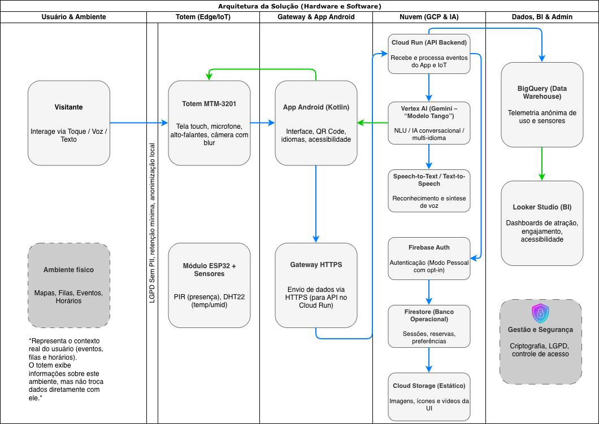

# FIAP - Faculdade de Informática e Administração Paulista

<p align="center">
<a href= "https://www.fiap.com.br/"></a>
</p>

<br>

# Enterprise Challenge - FlexMedia x FIAP

_Uma proposta de totem inteligente com IA, capaz de integrar diferentes tecnologias, promover personalização e enriquecer a interação dos usuários em ambientes de lazer e comércio._

## Grupo 16

## 👨‍🎓 Integrantes:

- <a href="https://www.linkedin.com/in/amanda-damasceno-martins/">566598 - Amanda Damasceno Martins</a>
- <a href="https://www.linkedin.com/in/cauasantoslt">566599 - Cauã Santos</a>
- <a href="https://www.linkedin.com/in/fabio-baldo-7959a22a/">567851 - Fabio Baldo</a>
- <a href="https://www.linkedin.com/in/giovanna-gomes-82b993372/">567169 - Giovanna Gomes Oliveira</a>
- <a href="https://www.linkedin.com/in/roberto-alvares-785059215/">568265 - Roberto Almeida Alvares</a>

## 👩‍🏫 Professores:

### Tutor(a)

- <a href="https://www.linkedin.com/in/sabrina-otoni-22525519b/">Sabrina Otoni</a>

### Coordenador(a)

- <a href="https://www.linkedin.com/in/andregodoichiovato/">André Godoi</a>

---

## 📜 Descrição
Esta seção detalha a proposta de escopo, arquitetura inicial e estratégia de desenvolvimento para o projeto do Totem Inteligente FlexMedia, conforme os requisitos da Sprint 1 do Challenge.

### 1. Justificativa do Problema

A proposta de valor do nosso totem inteligente se baseia na resolução de dores e frustrações reais, tanto para o visitante quanto para a empresa que gerencia o espaço.

#### 1.1. Para o Visitante (Usuário)

Identificamos quatro frustrações principais que afetam diretamente a experiência do visitante:

* **Desorientação e Sobrecarga:** Com a correria do dia a dia, os visitantes buscam agilidade. Ao entrar em ambientes complexos (como um cruzeiro, museu ou zoológico) pela primeira vez, a **falta de familiaridade** com o local gera ansiedade. O visitante não sabe onde está, para onde ir e se sente sobrecarregado, prejudicando a experiência logo no início.

* **Ruído e Desorganização:** Em locais com múltiplos eventos (shows, palestras, exposições), o visitante **se sente perdido em meio a tantas opções**. A dificuldade em organizar uma agenda pessoal, e que ao mesmo tempo seja agradável para toda a família, transforma o que deveria ser lazer em uma grande "dor de cabeça".

* **Filas e Perda de Tempo:** Os visitantes querem maximizar seu tempo de lazer. A necessidade de **enfrentar longas filas** para tarefas simples—como reservar uma mesa para a família, garantir um lugar no show ou até mesmo pedir um simples drink—gera atrito e quebra a percepção de valor do serviço.

* **Falta de Inclusão e Acessibilidade:** Um ambiente verdadeiramente acolhedor deve ser para todos. A **falta de soluções de acessibilidade** (como suporte a múltiplos idiomas, leitura de tela ou comandos de voz) ainda é uma realidade ignorada por muitas soluções. Isso cria barreiras que dificultam ou impede que visitantes com deficiência ou necessidades específicas tenham uma experiência equitativa.

#### 1.2. Para o Cliente (Empresa/Gestão)

Sob a ótica da FlexMedia e seus clientes (a gestão do navio ou museu), as dores são relacionadas à gestão de dados e perda de receita:

* **Gestão "no Escuro" (Ponto Cego):** A empresa sente a necessidade de ter mais informações sobre o fluxo de seus usuários. Sem dados, a gestão não tem **controle em tempo real** sobre o que acontece no espaço. Problemas como o congestionamento em um deck específico, ou a identificação de áreas que precisam de limpeza imediata, não são resolvidos com agilidade.

* **Perda de Oportunidades (Receita):** A coleta de dados de engajamento é crucial para o negócio. Sem entender o comportamento do usuário, a empresa **perde inúmeras oportunidades de receita** (upsell). Apenas uma simples coleta de dados poderia identificar potenciais pontos de lucro, como o momento exato de sugerir um pacote de bebidas na piscina, um upgrade no jantar ou um tratamento no spa baseado nas preferências do usuário.

### 2. Descrição da Solução Proposta: O Concierge Pessoal de IA

Para solucionar as dores listadas, propomos o **"Modelo Tango"**, o concierge inteligente da FlexMedia.

#### 2.1. O Conceito: "Modelo Tango"

Apresentamos o "Modelo Tango", a nossa solução de totem inteligente projetada para ser o assistente de bordo definitivo. Ele utiliza a mais recente **API do Google Gemini** para atuar como um assistente digital equitativo, proativo e que "abraça a tudo e todos", transformando a visita em uma experiência fluida e personalizada.

#### 2.2. Arquitetura Modular: A Solução para Equidade

A arquitetura é modular e projetada para a equidade, respeitando a privacidade e a necessidade do usuário.

* **Modo Público (Anônimo):** Para ser usado por "qualquer pessoa", não é necessário cadastro. É a solução ideal para consultas rápidas e para garantir que ninguém seja excluído. Funções incluem: Mapas gerais, Agenda de Eventos do dia, e FAQs.

* **Modo Pessoal (Autenticado):** Mediante um "opt-in" de privacidade, o usuário escaneia seu **QR Code** (do app do cruzeiro) na câmera do totem. Isso destrava uma "infinidade de opções" e personaliza 100% da experiência.

#### 2.3. Valor para o Visitante

O Modo Pessoal resolve diretamente as frustrações do visitante:

* **Navegação Inteligente:** O totem fornece um mapa dinâmico com a localização "Onde Estou" e calcula a melhor rota para o destino.
* **Agenda Personalizada com IA:** A agenda se torna interativa. Caso o cliente tenha dúvida, o Gemini oferece recomendações de eventos e atividades baseadas em seus gostos e histórico.
* **Fim das Filas (Reservas Instantâneas):** As "filas enormes" são substituídas por um sistema de Reservas Instantâneas, permitindo ao usuário garantir seu lugar em restaurantes ou shows com poucos cliques.
* **Acessibilidade por Design:** A solução é inclusiva. Um **"Menu de Acessibilidade"** dedicado oferece controle total por **Comandos de Voz**, **Leitor de Tela** (TalkBack), **Tradução Multi-idioma** e fontes ampliadas.

#### 2.4. Valor para o Cliente (A Solução de BI e Receita)

A gestão do Cliente da FlexMedia ganha ferramentas poderosas de gestão:

* **Gestão baseada em Dados:** A coleta de dados de interação (anônimos e agregados) é enviada em tempo real para o **BigQuery**.
* **Dashboards de BI em Tempo Real:** A gestão tem acesso a um dashboard (via Looker Studio) que mostra os mapas de calor de congestionamento e fluxo, permitindo a otimização de staff (como a limpeza).
* **Upsell Inteligente e Contextual:** A mesma IA que ajuda o usuário agora ajuda a empresa. O sistema identifica o contexto e o perfil do usuário para sugerir um **Upsell inteligente** (e não intrusivo), como uma oferta de spa ou um upgrade no jantar, evitando a "perda de lucros" e agindo em oportunidades reais.

### 3. Estratégia de Acessibilidade e Equidade

* **Ponto de Acesso Universal:** A interface terá um "Menu de Acessibilidade" sempre visível (ícone fixo) para ativar Leitor de Tela, Alto Contraste, Controle por Voz e Multi-idioma.
* **Interação Multimodal:** Suporte completo via Toque (Touchscreen), Voz (Microfone MTM-3201 + Google Speech-to-Text) e Leitor de Tela (TalkBack + Alto-falantes).
* **Equidade de Acesso:** O "Modo Público Anônimo" (detalhado na Seção 6) garante que o totem é útil para todos, mesmo sem celular ou QR Code.

### 4. Arquitetura da Solução (Hardware e Software)

Esta seção detalha a arquitetura técnica, tecnologias e o fluxo de dados da solução.

#### 4.1. Esboço da Arquitetura (Diagrama)

O diagrama abaixo representa o fluxo técnico do Totem Inteligente FlexMedia – "Modelo Tango", desde a interação do visitante até o processamento em nuvem e geração de insights.

A solução integra hardware (Totem MTM-3201 e sensores ESP32), aplicação Android (Kotlin) e serviços na Google Cloud Platform, com o Vertex AI (Gemini) atuando como núcleo de IA conversacional.

Todos os dados são transmitidos com segurança via Cloud Run (API Backend), armazenados em Firestore e BigQuery, e exibidos em dashboards de Looker Studio.

A arquitetura é modular, acessível e totalmente aderente à LGPD, garantindo equidade, anonimização local e governança de dados em tempo real.

*Para ver o fluxograma (diagrama) em tamanho real, [clique neste link](https://drive.google.com/file/d/1gXG1C9nCD_qj7AXG-Ya2hkVu7tJmJ37D/view?usp=sharing).*



### 🔵🟢 Legenda de Fluxos (Color Code)

As setas no diagrama seguem um código de cores que representa o fluxo de dados e processamento dentro da arquitetura:

* **🔵 Fluxo principal (ida):** Representa o envio de informações do usuário e sensores — desde a interação no Totem até o processamento na nuvem (Cloud Run e Vertex AI).
* **🟢 Fluxo de retorno (volta):** Indica as respostas da IA (Gemini) e os dados retornados ao Totem ou dashboards (ex: recomendações, textos, voz, BI).
* **⚫ Cinza Pontilhado (Contexto):** Elementos referenciais (como o ambiente físico), que não trocam dados diretamente, mas contextualizam a operação do sistema.

#### 4.2. Hardware (Borda / IoT)

A nossa estratégia de hardware é centrada em uma unidade principal robusta, complementada por um módulo de sensores IoT flexível.

##### Hardware Principal: O Totem

A solução é construída ao redor do **`Totem Tomate MTM-3201`**. A escolha é estratégica por ele ser uma unidade "all-in-one" que já inclui os componentes essenciais para as *features* que definimos:

* **Sistema Android Nativo:** Permite rodar nosso aplicativo (desenvolvido em Kotlin/Android Studio) de forma otimizada e facilita a comunicação com o Google Cloud e nosso assistente "Modelo Tango".
* **Câmera Integrada:** Fundamental para o "Modo Pessoal", permitindo a leitura do **QR Code** para autenticação.
* **Microfone e Alto-falantes:** Componentes chave da nossa estratégia de **Acessibilidade**, permitindo os Comandos de Voz e o Leitor de Tela (TalkBack).
* **Design Robusto:** O design integrado é ideal para o ambiente de alto fluxo de um cruzeiro, facilitando a manutenção.

##### Módulo Auxiliar: Sensores IoT (ESP32)

Para complementar o totem, utilizamos um **módulo auxiliar de IoT**, baseado no `ESP32` e conectado aos seguintes sensores:

* **`ESP32`:** Atua como o "mini-cérebro" dos sensores. Escolhido por seu baixo consumo de energia e conectividade Wi-Fi nativa, ele coleta os dados e os envia para a nuvem.
* **Sensor `PIR` (Presença):** Usado para detectar a aproximação de um usuário. Isso permite que o totem "acorde" (saia da tela de descanso) e inicie a interação proativamente (ex: "Olá, posso ajudar?"), como visto no `SENSOR_PAYLOAD.JSON`.
* **Sensor `DHT22/BME280` (Ambiente):** Mede a temperatura e umidade exatas do local. Esses dados são usados para alimentar o "Widget de Clima" no totem e para gerar relatórios de ambiente para a gestão do navio.

Este módulo (ESP32) envia seus dados de sensor diretamente para a nossa API no Cloud Run, que por sua vez alimenta os dashboards de BI, conforme detalhado por completo nas seções `4.4` e `5`.
#### 4.3. Software (Aplicação)

* **IDE:** `Android Studio`
* **Linguagem:** `Kotlin`
* **Justificativa:** O desenvolvimento será nativo Android (usando Kotlin, a linguagem moderna preferida pelo Google) para garantir performance máxima, acesso direto à Câmera e Microfone do totem MTM-3201, e integração otimizada com o ecossistema Google Cloud.

#### 4.4. Nuvem (Backend e IA)
Nossa solução utiliza os serviços da Google Cloud Platform (GCP) para garantir alta disponibilidade, segurança e inteligência. A arquitetura conecta o totem MTM-3201 (App Android) e os sensores (`ESP32`) à nuvem através de uma API central.

O fluxo principal é: O usuário interage com o totem, o app Android manda essa informação para a API (hospedada no `Cloud Run`). Essa API conversa com o nosso assistente "Modelo Tango" (rodando no `Vertex AI Gemini`), que processa o pedido e retorna a resposta inteligente. Em paralelo, os dados da interação são salvos no `Firestore` (para uso imediato) e no `BigQuery` (para análises futuras).

Os serviços utilizados são:

* **Cloud Run:** Hospeda nossa API (backend) principal. Permite escalabilidade automática e garante alta disponibilidade sem gerenciamento de servidores.

* **Vertex AI (Gemini):** É o cérebro do "Modelo Tango". Entende voz e texto, responde de forma personalizada e fornece suporte multi-idioma, garantindo a acessibilidade que definimos na Seção 3.

* **Firestore:** Banco de dados NoSQL usado para guardar dados rápidos da aplicação, como sessões de usuário, preferências de idioma e reservas ativas.

* **BigQuery:** Nosso Data Warehouse. Analisa todos os dados históricos de interação e dos sensores, permitindo à gestão do navio (o cliente) visualizar os dashboards de BI (no Looker Studio).

* **Cloud Storage:** Armazena os arquivos estáticos que o totem precisa exibir, como as imagens da "Galeria de Fotos", vídeos e ícones da interface.

* **Firebase Authentication:** Cuida da segurança e autenticação, gerenciando tanto os administradores do sistema quanto o "Modo Pessoal" (autenticado via QR Code).

### 5. Estratégia de Coleta de Dados
Nossa estratégia de coleta de dados é projetada para respeitar a privacidade do usuário (LGPD) e, ao mesmo tempo, gerar valor analítico para a gestão.

Existem dois modos de coleta:

1. **Modo Pessoal (Autenticado):** Quando o usuário escaneia o QR Code, ele ativa um perfil temporário. O sistema coleta dados de interação (buscas, reservas, preferências) ligados a esse perfil para personalizar a experiência.

2. **Modo Anônimo (Padrão):** Não coleta nenhuma informação pessoal identificável. Apenas salva estatísticas gerais e anônimas (ex: "o botão 'mapa' foi clicado 100x hoje") para alimentar os dashboards de BI.

Para simular o pipeline de dados nesta Sprint 1, os blocos de código JSON abaixo representam os dados que o App Android e os sensores IoT (ESP32) enviarão para a nossa API no Cloud Run.

#### Exemplo 1: `INTERACAO_PAYLOAD.JSON`
(Simula o que o **App Android** envia após uma interação de voz)

```json 
  {
  "session_id": "sess_10294",
  "mode": "anonymous",
  "input_type": "voice",
  "input_text": "Quais eventos vão acontecer hoje à noite?",
  "tango_response": "Hoje teremos show de jazz no Deck 3 às 21h.",
  "timestamp": "2025-10-29T19:42:00Z",
  "context": {
    "device": "Totem MTM-3201",
    "language": "pt-BR",
    "location": "Deck 5"
    }
  }
```
#### Exemplo 2: `SENSOR_PAYLOAD.JSON`
(Simula o que o **Módulo ESP32** envia. Note que o ID do sensor é separado e aponta para o totem que ele serve)

```json
{
  "device_id": "ESP32-SENSOR-004",
  "linked_totem_id": "MTM3201-CRZ-01",
  "timestamp": "2025-10-29T19:43:00Z",
  "sensor_data": {
    "temperature": 23.8,
    "humidity": 71.4,
    "presence_detected": true
  },
  "location": "Deck 5 - Área de Lazer"
}
```

### 6. Estratégia de Segurança e Privacidade

A solução "Modelo Tango" foi estruturada com foco total em segurança, privacidade e transparência, alinhando-se às diretrizes da Lei Geral de Proteção de Dados (LGPD).

#### 6.1. Proteção de Dados (em Trânsito e Repouso)
* **Dados em Trânsito:** Toda a comunicação entre o totem (App Android e ESP32) e os serviços em nuvem (API no Cloud Run) é feita **exclusivamente por conexões criptografadas (HTTPS/TLS 1.3)**, evitando interceptações.
* **Dados em Repouso:** Os dados pessoais (como as preferências do Modo Pessoal) são **armazenados criptografados no Firestore**. Os serviços de nuvem (GCP) e backups também são criptografados por padrão.
* **Autenticação:** O acesso é protegido pelo **Firebase Authentication**, que gerencia a autenticação segura de administradores (com RBAC) e dos usuários no Modo Pessoal.

#### 6.2. Modos de Operação e Minimização de Dados (LGPD)
O sistema foi desenhado com base no princípio da minimização de dados, operando em dois modos distintos:

* **Modo Anônimo (Padrão):** Não coleta dados pessoais. São registradas apenas informações técnicas e estatísticas, como número de interações, comandos mais utilizados e dados de sensores (temperatura, umidade e presença).
* **Modo Pessoal (Opt-in):** Ativado quando o usuário escaneia um QR Code, criando um perfil temporário. Os dados são armazenados criptografados e excluídos automaticamente após o término da sessão. O usuário pode encerrar o modo pessoal a qualquer momento, preservando total controle sobre suas informações.

#### 6.3. Governança e Transparência
Para garantir total conformidade com a LGPD, o sistema segue práticas rigorosas de governança:
* Consentimento explícito e informado para uso do modo pessoal;
* Política de privacidade acessível diretamente no totem;
* Controle de acesso baseado em papéis (RBAC) para administradores;
* Logs de segurança e auditoria monitorados em tempo real via Cloud Logging.

### 7. Plano de Desenvolvimento (Divisão de Tarefas - Sprint 1)

* **Cauã (PM):** Definição do produto (Seções 1 e 2), priorização de Acessibilidade e integração do `README.md`.
* **Fabio (Arquiteto):** Desenho do diagrama de arquitetura da solução (Seção 4.1).
* **Giovanna (Cloud/Dados):** Detalhamento da arquitetura de nuvem (4.4) e estratégia de dados simulados (5).
* **Amanda (Hardware/IoT):** Detalhamento do hardware (4.2) e suas justificativas de acessibilidade.
* **Roberto (Segurança):** Detalhamento da estratégia de Segurança, Privacidade e Equidade (6).

---

## 📁 Estrutura de pastas

```sh
├──Assets
│  ├── Diagrama
│  │   └── diagrama-arquitetura.jpg
│  └── logo-fiap.png
└── README.md
```

## 🗃 Histórico de lançamentos

* 0.0.1 - 30/10/2025
    * Criação do documento, definição de escopo (MVP), arquitetura e plano de desenvolvimento para a Sprint 1.

## 📋 Licença

<p xmlns:cc="http://creativecommons.org/ns#" xmlns:dct="http://purl.org/dc/terms/"><a property="dct:title" rel="cc:attributionURL" href="https://github.com/agodoi/template">MODELO GIT FIAP</a> por <a rel="cc:attributionURL dct:creator" property="cc:attributionName" href="https://fiap.com.br">Fiap</a> está licenciado sobre <a href="http://creativecommons.org/licenses/by/4.0/?ref=chooser-v1" target="_blank" rel="license noopener noreferrer" style="display:inline-block;">Attribution 4.0 International</a>.</p>